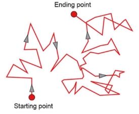

Summer 2022 Project Report

Brownian Motion

First Year Summer Project

Aditya Ramdasi

Supervised by

Prof. Bikram Phookun Philip Cherian

Department of Physics

Ashoka University Delhi NCR, India

Submitted on     September 25, 2022

Abstract

The main aim of this project is to gain familiarity with various methods of numerical integration (Euler-Cromer, Leapfrog, Runge-Kutta-4) and use them to solve the differential equations in physics, computationally. In this project, the Brownian motion of a single particle was modelled using the three algorithms mentioned above, and their results were compared with the analytical solution. Then, a uniformly random isotropic force was introduced on the particle to model a damping force. The values of position - (x), velocity - (v), x2,v2 were calculated for every trial, and then averaged over 1000 trials and plotted, to see their variation with time. Finally, the relation between mass diffusivity (D) and the damping constant (γ) of the Brownian Motion was found analytically and verified numerically.

1

Contents

[1 Introduction](#_page3_x72.00_y72.00) 1

1. [Describing the physical system .](#_page3_x72.00_y95.79) . . . . . . . . . . . . . . . . . . . . . . . 1
1. [Constructing the Differential Equation .](#_page3_x72.00_y546.06) . . . . . . . . . . . . . . . . . . 1

[2 Model and Methods](#_page4_x72.00_y72.00) 2

1. [Analytical Solution ](#_page4_x72.00_y95.79). . . . . . . . . . . . . . . . . . . . . . . . . . . . . . 2
1. [Numerical Solutions .](#_page4_x72.00_y638.18) . . . . . . . . . . . . . . . . . . . . . . . . . . . . . 2
1. [Euler-Cromer ](#_page5_x72.00_y72.00). . . . . . . . . . . . . . . . . . . . . . . . . . . . . 3
1. [Leapfrog ](#_page5_x72.00_y222.16). . . . . . . . . . . . . . . . . . . . . . . . . . . . . . . . 3
1. [Runge-Kutta (RK-4) .](#_page5_x72.00_y397.92) . . . . . . . . . . . . . . . . . . . . . . . . 3
1. [Plots for all three methods .](#_page5_x72.00_y650.87) . . . . . . . . . . . . . . . . . . . . . 3
1. [Comparing with Analytical Solution ](#_page6_x72.00_y526.35). . . . . . . . . . . . . . . . 4
3. [Gaussian and Uniform Randomness .](#_page7_x72.00_y684.44) . . . . . . . . . . . . . . . . . . . . 5
4. [Introducing uniformly random isotropic force . ](#_page8_x72.00_y310.70). . . . . . . . . . . . . . . 6
4. [Averaging over 1000 trials ](#_page9_x72.00_y134.30). . . . . . . . . . . . . . . . . . . . . . . . . . 7
4. [Plotting values averaged over 1000 trials with time .](#_page9_x72.00_y528.57) . . . . . . . . . . . 7
4. [Exploring the relation between D and γ](#_page10_x72.00_y624.16) . . . . . . . . . . . . . . . . . . 8

[3 Results and Discussion](#_page12_x72.00_y72.00) 10

1. [Explaining the ⟨x2⟩vs time plot ](#_page12_x72.00_y95.79). . . . . . . . . . . . . . . . . . . . . . 10
1. [Explaining the D vs γ plots analytically ](#_page12_x72.00_y248.53). . . . . . . . . . . . . . . . . . 10
1. [Discussion on limitations ](#_page12_x72.00_y646.05). . . . . . . . . . . . . . . . . . . . . . . . . . . 10

[4 Conclusion](#_page13_x72.00_y457.11) 11 [5 References](#_page14_x72.00_y72.00) 12 [6 Appendix](#_page14_x72.00_y343.79) 12

1 Introduction

1. Describing the physical system

Figure 1: Brownian motion of a single particle

Brownian motion refers to the random movement of small particles inside a fluid. This movement occurs due to the numerous and frequent collisions between particles, and thus requires no external force. Every individual particle changes its direction and velocity drastically after every collision. But the collisions are isotropic on the whole, and thus the system can be modelled statistically like a random-walk. Figure [1 represen](#_page3_x72.00_y137.38)ts this motion of a single particle, wherein every small abrupt change in direction is due to a collision.

An example of the kind of a system modelled in this project can be the motion of a water molecule (or any small particle that is light enough) in the atmosphere. The forces on the molecule will be a random isotropic force F (t) due to the collisions with other particles, and a damping force proportional to the velocity of the particle.

2. Constructing the Differential Equation

Here, we convert the subjective description of our system (as mentioned above) into a differential equation, which can then be solved both analytically and numerically. Since the damping force is proportional to the velocity, it can be modelled as -

Fdamp = −mγv

The random isotropic force F(t) will be modelled by using a uniformly random number generator symmetrically around 0 (to prevent biased forces). This force acts on a much smaller timescale compared to F , and is elaborated further upon in Section [3.3.](#_page12_x72.00_y646.05)

damp

The net force is given by Newton’s Second law of Motion. Thus, combining all these

3 aspects, we can construct our final differential equation as follows -

d2x dx

m = −mγ + F (t) (1)

dt2 dt

[^1]2 Model and Methods

1. Analytical Solution

Initially, to compute the analytical solution, we assume F (t) = 0, and solve the resulting differential equation, which is -

mx¨ + mγx˙ = 0 (2) On solving this equation using the ansatz x(t) = eλt, we get the following solution -

x(t) = C1(e−γt) + C (3)

γ [^2]

v(t) = −C e−γt (4)

1

Here, C1,C2 are the constants of integration.

u

If x(0) = x0,v(0) = u0, then C1 = −u0,C2 = x0 + γ0.

It’s reasonable to assume that we define our origin where we start measuring the trajectory of the particle i.e. x = 0. The velocity may or may not be 0. Thus, we plot the analytical

0

solution with x0 = 0,u0 = 10 and γ = 3 to get the following plot -

Figure 2: Analytical Solution

2. Numerical Solutions
1. Euler-Cromer

This is a first-order method of numerical integration used, whose increments in time steps are given by -

x(t + ∆t) = x(t) + v(t) ·∆t v(t + ∆t) = v(t) + a(t) ·∆t

The plot of this solution can be seen in Figure 3.

2. Leapfrog

This is a second-order method of numerical integration used, whose increments in time steps are given by -

∆t

x(t + ∆t) = x(t) + v(t + ) ·∆t

2

∆t ∆t

v(t + ) = v(t − ) + a(t) ·∆t

2 2

The plot of this solution can be seen in Figure 3.

3. Runge-Kutta (RK-4)

This is fourth-order method of numerical integration used. In this method, we calculate the slope at 4 points during a single time-step, and use their weighted sum to get the final estimate of the slope (change in value of function) over the entire time-step. The algorithm can be represented as follows -

k = hf (x ,y )

1 n n

k = hf (x + h/2,y + k /2)

2 n n 1

k = hf (x + h/2,y + k /2)

3 n n 2

k = hf (x + h,y + k )

4 n n 3

1

yn+1 = yn + 6(k1 + 2k2 + 2k3 + k4) The plot of this solution can be seen in Figure 3.

4. Plots for all three methods

Initial conditions used - X0 = 0,V0 = 10,T = 10,dt = 0.1,γ = 3

 

(a) Euler-Cromer Solution (b) Leapfrog Solution

(c) RK-4 Solution

Figure 3: Numerical Solutions

5. Comparing with Analytical Solution

We plot all three numerical solutions with the analytical solution for both position and velocity in Figure [4.](#_page7_x72.00_y64.34)

 

(a) All 4 solutions - position (b) All 4 solutions - velocity

Figure 4: Plotting all solutions together

From Figure [4 ](#_page7_x72.00_y64.34)we can see that the absolute difference between numerical and analytical solutions is not clearly visible. Thus, we instead plot the relative differences of each numerical solution with the analytical solution, to compare their relative accuracy -

 

(a) Analytical - Numerical (position) (b) Analytical - Numerical (Velocity)

Figure 5: Relative differences in numerical solutions

From Figure [5, ](#_page7_x72.00_y369.37)we can see that the RK-4 integrator gives the least deviation from the analytical solution. Thus, we choose the RK-4 integrator as our primary method for numerical integration in all further parts of this project.

3. Gaussian and Uniform Randomness

Before generating random numbers with every integration time-step, we first generate samples of both Gaussian and Uniform randomness and plot their histograms to observe and understand their nature and distribution (as show in Figure 6).

 

(a) Sample Gaussian Distribution (b) Sample Uniform Distribution

Figure 6: Sample distribution of 10000 random numbers

4. Introducing uniformly random isotropic force

Now, we modify our RK-4 integrator’s acceleration function to accommodate a non-zero random isotropic force, F (t). We generate a random float number in the range (-1,1) with every time-step and use it to model the random force in our equation.

Considering the physical system being modelled, the random force needed to be unbiased and have a low magnitude. Thus, the range of (-1,1) was chosen as it is symmetric about 0 (unbiased force) and has relatively small magnitude. After discussing with a senior, an important limitation of this project in modelling the given physical situation was identified. This is clarified in Section [3.3.](#_page12_x72.00_y646.05)

The resulting trajectories of x and v followjagged paths when plotted with time. Figure [7 ](#_page8_x72.00_y531.42)shows the jagged trajectories obtained for two extreme values of the damping constant γ.

 

(a) γ = 0.5 (normal damping) (b) γ = 20 (very highly damped)

Figure 7: RK4 solutions with different damping constants (γ)

As expected, the change in velocities of the particle had much smaller magnitudes for high values of damping (Figure 7[ (b))](#_page8_x72.00_y531.42) than for lower values of damping (γ) (Figure 7 (a)).

5. Averaging over 1000 trials

The next step is to average these jagged trajectories over a large number of trials (say 1000). To do this, we create a 2D NumPy array as shown in Table 1. [The](#_page9_x72.00_y321.41) data obtained

in the ith trial fills in the ith row of the 2D array. After 1000 trials, we calculate the arithmetic mean of all the data-points in a single column, to average over all 1000 trajectories. The arithmetic means of the j th column is stored as the j th element of another array. Finally, this array containing the values averaged over 1000 trajectories is used to plot quantities with time. This averaged array is generated separately for all 4 quantities, x,x2,v,v2. The Table below helps us to visualize the construction of the 2D array -

||dt|2 ×dt|3 ×dt|4 ×dt|5 ×dt|...|...|n ×dt = Tf|
| :- | - | - | - | - | - | - | - | - |
|Trial 1|D 1,1|D 1,2|D 1,3|D 1,4|D 1,5|...|...|D 1,n|
|Trial 2|D 2,1|D 2,2|D 2,3|D 2,4|D 2,5|...|...|D 2,n|
|Trial 3|D 3,1|D 3,2|D 3,3|D 3,4|D 3,5|...|...|D 3,n|
|Trial 4|D 4,1|D 4,2|D 4,3|D 4,4|D 4,5|...|...|D 4,n|
|Trial 5|D 5,1|D 5,2|D 5,3|D 5,4|D 5,5|...|...|D 5,n|
|...|...|...|...|...|...|...|...|...|
|...|...|...|...|...|...|...|...|...|
|Trial 1000|D 1000,1|D,1000,2|D 1000,3|D 1000,4|D 1000,5|...|...|D 1000,n|
|Final Array|Avg,1|Avg,2|Avg,3|Avg,4|Avg,5|...|...|Avg,n|
Table 1: 2D array visualization for averaging trajectories

6. Plotting values averaged over 1000 trials with time

Figure [8 ](#_page10_x72.00_y284.29)shows the graphs obtained when the averaged arrays are plotted with time. Here, the initial conditions used were - X = 0,V = 0,T = 500,dt = 0.1,γ = 0.8 -

0 0

 

(a) Averaged x over 1000 trials (b) Averaged v over 1000 trials

 

(c) Averaged x2 over 1000 trials (d) Best fit line

Figure 8: Plots for quantities averaged over 1000 trials

The expected nature of the mean squared x vs time graph is explained in Section [3.1,](#_page12_x72.00_y95.79) and is observed to meet the expectations. The above image is for X = 0,V = 0.

0 0 However, the same linear relation is also observed after some time (around 1/γ value) for

different initial conditions, since the system needs roughly that much time to ‘forget’

its initial conditions.

7. Exploring the relation between D and γ

In this section, we seek to find the relation between mass diffusivity (D) and the damping constant (γ) analytically, and then verify the same result numerically.

The expression for determining mass diffusivity D is given by the Einstein relation -

⟨x2⟩= 2Dt (5)

Here, ⟨x2⟩is the mean squared displacement of the particle, the same quantity which we calculated and plotted against time in Figure 8.[ Th](#_page10_x72.00_y284.29)us, we calculate the values of D

using Equation [5 ](#_page10_x269.36_y716.95)by running a loop over 100 values of γ in the range [0.5, 3]. To see the variation of D with different values of γ, we plot these two quantities against each other in Figure [9 -](#_page11_x72.00_y124.19)

Figure 9: D vs γ

From the above figure, we get an approximate idea of the nature of this graph. However, we still don’t know the exact relation between D and γ. For this, we plot the log-log graph for both these quantities, to know the exact power-law relation. Thus, Figure [10 ](#_page11_x72.00_y419.98)shows the log − log plot -

Figure 10: log(D) vs log(γ)

Figure [10 ](#_page11_x72.00_y419.98)depicts a linear trend in the plot. Using NumPy’s inbuilt polyfit function, we find the slope and intercept value of the best-fit line for this graph. The value of the slope for the best fit line comes out to be -2.0015. This will be explained in Section [3.2.](#_page12_x72.00_y248.53)

3  Results and Discussion
1. Explaining the ⟨x2⟩vs time plot

Equation [5 ](#_page10_x269.36_y716.95)gives the relation between ⟨x2⟩and time to be a linear one. Figure 8 [(c) ](#_page10_x72.00_y284.29)and (d) verify this linear relation. Einstein proposed this particular relation in his 1905 paper titled -“Investigations on the Theory of the Brownian movement ”, in which he argued that the displacement of a Brownian particle is proportional to the square root of the elapsed time. The half of the proportionality constant gives us mass diffusivity D. Thus, the linear relation was theoretically expected, and computationally verified.

2. Explaining the D vs γ plots analytically

Figure [9 ](#_page11_x72.00_y124.19)tells us the approximate relation between D and γ. However, we plot their log-log graphs to find out the exact power-law relation. Let D have some power-law relation with γ, “n”. Then, we have -

D(γ) = k(γ)n

log(D(γ)) = n log(γ) + log k

Thus, the slope of the best fit line in the log-log graph gives us the exponent “n” of the power law. From Figure [10, ](#_page11_x72.00_y419.98)we get the slope of the best fit line to the log-log graph is approximately -2. Equations [3 and](#_page4_x508.32_y220.09) 4 tell us that x is directly proportional to 1/γ . Thus, we have the following -

1 x ∝

γ ⟨x2⟩ ∝x2

1 =⇒ ⟨x2⟩ ∝

γ2 =⇒ ⟨x2⟩ ∝γ− 2

Since D varies in direct proportionality to ⟨x2⟩, we can say that D varies with γ with an inverse-square power law. This confirms with the observed value of the best-fit line to the log-log graph, which was also -2. Thus the analytical result is verified computationally.

3. Discussion on limitations

From discussions with the project guides, seniors and peers, a number of limitations were identified in the code and thus scope of this project. Some of these are as follows -

1. There are effectively two very distinct time-scales on which this physical system operates. The uniformly random, wholly-isotropic collisions of the particle occur on a timescale of roughly 10−11 to 10−9 seconds (or smaller). However, the damping

force produced as a result of the small non-isotropy acts on the particle in a much larger timescale of roughly 10−2 to 10−1 seconds. Thus, while calculating the damping force in a single time-step, it is a very reasonable approximation to put F (t) = 0, since the net force due to all (roughly) 1010 collisions can be averaged

out to 0. However, in the code written for this project, the random force F (t) is calculated and added to the integrator at the same timescale as the damping force

i.e. once every time-step. This is an important limitation that was identified for this project.

2. Following the previous discussion, it is important that we choose a suitable time-step ‘dt’ value in the code, one that finds a balance and caters to both the timescales. However, the ‘dt’ value used in all parts of this project is simply 0.1 seconds, since such small time-steps increase the compiling time of the code manifold, and may even approach the computational limit of the tools used.
2. It was found during discussions that numerical integrators like Leapfrog and Velocity-Verlet work best for systems whose energy is conserved, while Euler-Cromer and Runge-Kutta methods work best for damped energy systems (like the one in this project). However, this distinction couldn’t be verified due to computational constraints.

These were the major identified limitations in the overall scope and code of this project. Pointers for further extensions of this project include -

1. Numerical verification of all other Einstein results for Brownian motion
1. Simulating Brownian motion for a multi-particle system
1. Exploring changes to Brownian motion by simulating different dispersion mediums
4  Conclusion

The physical system of a single particle executing Brownian motion was modelled into a simpler differential equation, and then solved. Three methods of numerical integration were studied; Euler-Cromer, Leapfrog and RK-4, and their results were compared with the analytical solution. This was used to determine the most appropriate numerical integration method for the physical system simulated in the project. In the results, the mean squared displacement of the particle was found to vary linearly with time, confirming the relation proposed by Einstein in his 1905 paper. The relation between mass diffusivity D and damping coefficient γ was found analytically, and verified computationally. Finally, some important computational limitations of the project were addressed, and scope for further extensions of this project were identified.

5  References
1. “Leapfrog Integration.” 2020. Wikipedia. April 6, 2020. https://en.wikipedia.org/wiki/Leapfrog~~ integration.
1. Nieves, Oscar. 2022. “Einstein’s Brownian Motion.” Medium. March 16, 2022. https://www.cantorsparadise.com/einsteins-brownian-motion-9d2d2f9c3d04.
1. Wikipedia Contributors. 2019. “Brownian Motion.” Wikipedia. Wikimedia Foundation. November 9, 2019. https://en.wikipedia.org/wiki/Brownian~~ motion.
1. ———. 2022. “Log–Log Plot.” Wikipedia. Wikimedia Foundation. May 26, 2022. https://en.wikipedia.org/wiki/Log%E2%80%93log~~ plot.

[5]Image Credits - Vollbrecht, Cecilia. 2022. “Brownian Motion.” ChemTalk. February 14, 2022. https://chemistrytalk.org/brownian-motion/.

6  Appendix

There are two relevant Jupyter notebooks (code files) associated with this project -

1. Supplementary code: Exploring numerical integration methods and random number generation
1. Main code: Verifying Einstein Relation and exploring D vs γ
14

[^1]: We now solve the same equation using three different methods of numerical integration and see how closely each of them resemble the analytical solution.
[^2]: 